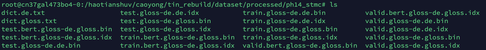
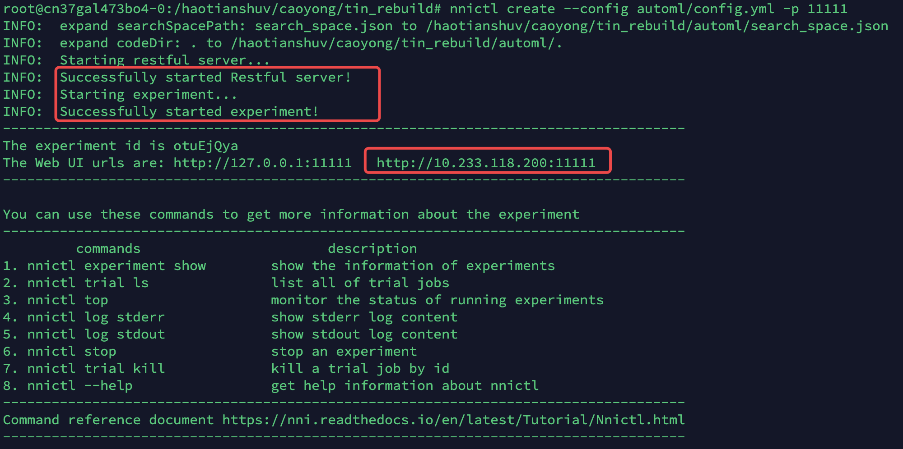
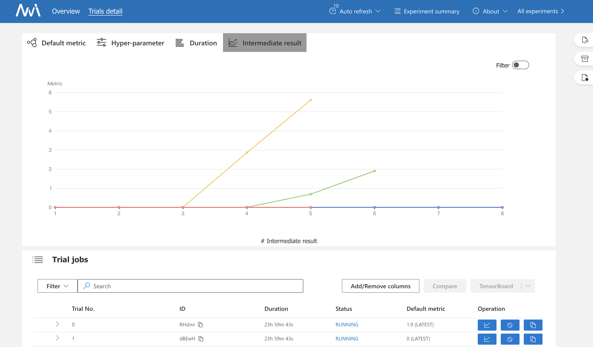

# Explore More Guidance: A Task-aware Instruction Network for Sign Language Translation Enhanced with Data Augmentation

by [Yong Cao](https://yongcaoplus.github.io/), Wei Li, [Xianzhi Li](https://nini-lxz.github.io/), [Min Chen](https://people.ece.ubc.ca/~minchen/), [Guangyong Chen](https://guangyongchen.github.io/), Zhengdao Li, [Long Hu](https://people.ece.ubc.ca/~minchen/longhu/), [Kai Hwang](https://myweb.cuhk.edu.cn/hwangkai).

## 1. Introduction

 This repository is for our Findings of NAACL 2022 paper '[Explore More Guidance: A Task-aware Instruction Network for Sign Language Translation Enhanced with Data Augmentation
](https://arxiv.org/abs/2204.05953)'. In this paper, we propose a task-aware instruction network, namely TIN-SLT, for sign language translation, by introducing the instruction module and the learning-based feature fuse strategy into a Transformer network. 
 In this way, the pre-trained model's language ability can be well explored and utilized to further boost the translation performance. 
 Moreover, by exploring the representation space of sign language glosses and target spoken language, we propose a multi-level data augmentation scheme to adjust the data distribution of the training set. 
 We conduct extensive experiments on two challenging benchmark datasets, PHOENIX-2014-T and ASLG-PC12, on which our method outperforms former best solutions by 1.65 and 1.42 in terms of BLEU-4.


## 2. Dataset and Trained models
* Dataset can be downloaded in [Google Drive](https://drive.google.com/drive/folders/1NNta7CgBF0Ny5IbzmBKP-C1B33aR6kWZ?usp=sharing).       
* Our trained model can be downloaded in [Google Drive](https://drive.google.com/drive/folders/1s26goE0Rh4T9L_d-6XDfHKYP_FPGPveR?usp=sharing). 
If the trained model doesn't work or if there are any issues, please feel free to contact us.
* The pre-trained model can be downloaded in [bert-base-german-dbmdz-uncased](https://drive.google.com/file/d/105RuAqXLYj5mPeHbp3pzEKCWlSL7wR0o/view?usp=sharing).
## 3. Execute Steps

#### Step 1 install dependencies

```shell script
pip install --editable .      
```

Note that, if the download speed is not fast, try this:

```shell script
pip install --editable . -i https://pypi.tuna.tsinghua.edu.cn/simple   
```

Our code is implemented over Python 3.6.8, and Pytorch 1.5.0+cu101. (We didn't test the code on other package version.)      
```shell script
pip install torch==1.5.0+cu101 -f https://download.pytorch.org/whl/torch_stable.html
```

#### Step 2 Prepare dataset
If you use our prepared dataset, skip this step. 
Else:
```shell script
cd preprocessing      
python prepare_data.py
```
Then you can get the following files in your destination dir:



#### Step 3 Train by AutoML
Choose one training method (with / without automl).
##### (1) Without AutoML

```shell script
cd trainer
# please config train.sh first, and then:
sh train.sh
```

##### (2) With AutoML
Config automl/config.yml and automl/search_space.json files, and run the following cmd to train in your terminal:
```shell script
nnictl create --config automl/config.yml -p 11111
# -p means the port you wish to visualize the training process in browser.
```
If succeed, you should see the following logs in your terminal:


Go to your browser to see the training process.




Please refer to [NNI Website](https://nni.readthedocs.io/) for more instructions on NNI.


#### Step 4 Obtain Mertrix

```shell script
cd postprocessing       
sh get_bleu4.sh
```

## 4. Questions
Please contact [yongcao_epic@hust.edu.cn]().


## 5. Some problems you may encounter:

1.'ascii' codec can't decode byte 0xef
```shell script
UnicodeDecodeError: 'ascii' codec can't decode byte 0xef in position 1622: ordinal not in range(128)
```
=> please run this command in your terminal

```shell script
export LC_ALL=C.UTF-8
source ~/.bashrc
```

2.Resource punkt not found. / Resource wordnet not found.

please run this command in your terminal
```shell script
python
  >>> import nltk
  >>> nltk.download('wordnet')
  >>> nltk.download('punkt')
```
